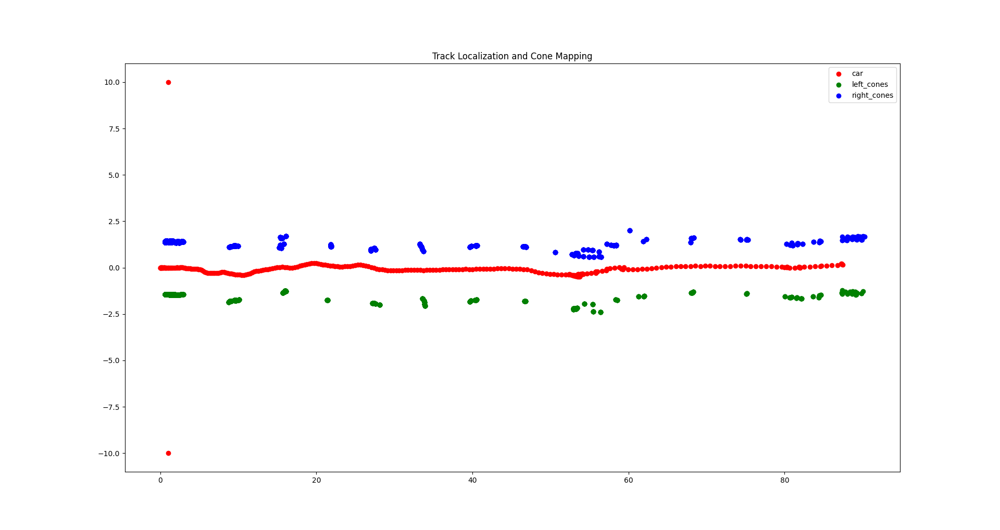
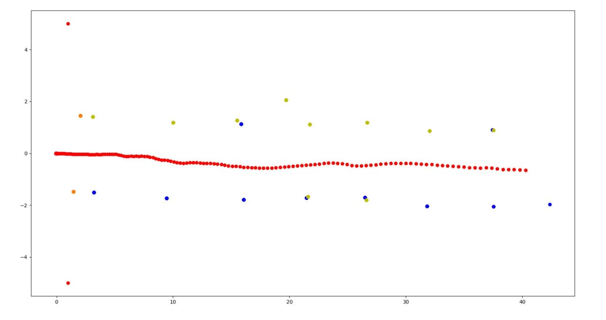
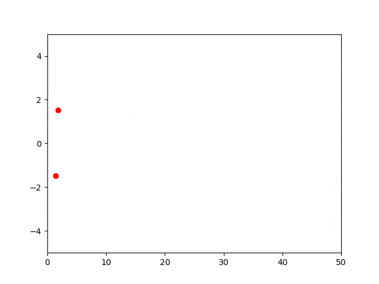

# SLAM

This SLAM implementation leverages the localization module `laser_scan_matcher`. The placing of the cones is performed by mapping the cones' relative positions with respect to the car using its absolute position `pose_stamped` generated by `laser_scan_matcher`.

## Usage

<!--
The slam toolbox package can be downloaded at the following link [here](https://github.com/SteveMacenski/slam_toolbox)

It's important to note that the provided toolbox builds the map using a `sensor_msgs::LaserScan` but the LIDAR outputs data of type `sensor_msgs::PointCloud`.  

To address this iussue, we transform the point cloud into laser scan using the [`pointclod_to_laserscan package](http://wiki.ros.org/pointcloud_to_laserscan)
The slam toolbox listens for `LaserScan` messages on the topic specified in `slam_toolbox/config` in the param `scan_topic`.
-->

  

Hereby follows a concise guide on how to assembly the various components:

```console
foo@bar:~$ git clone https://github.com/unipi-smartapp-2021/SLAM
foo@bar:~$ cd SLAM
foo@bar:~$ git submodule update --init --recursive
foo@bar:~$ sudo apt-get install libgsl0-dev
```

If `catkin_make` fails due to missing `csm` package, install it:

```console
foo@bar:~$ cd src
foo@bar:~$ git clone https://github.com/AndreaCensi/csm
```

Overwrite the following files:

```console
foo@bar:~$ cp utils/pointcloud_to_laserscan_nodelet.cpp src/pointcloud_to_laserscan/src/pointcloud_to_laserscan_nodelet.cpp
foo@bar:~$ cp utils/sample_node.launch src/pointcloud_to_laserscan/launch/sample_node.launch
foo@bar:~$ cp utils/laser_scan_matcher.cpp src/scan_tools/laser_scan_matcher/src/laser_scan_matcher.cpp
```

Try and pray that everything builds:

```console
foo@bar:~$ catkin_make
```

## Run it

### Launch file
You can now run the implemented slam node by running the *slam.launch* launch file:
```console
foo@bar:~$ roslaunch cone_mapping slam.launch
```
In a different terminal play the desired rosbag:
```console
foo@bar:~$ rosbag play <bag> --clock
```

The launch file will run the following nodes:
- pointcloud_to_laserscan_node
- laser_scan_matcher_node
- cone_mapping.py
- cone_drawing.py

### Manual execution

If you are interested in **running individually** the nodes just apply the following instructions.

**Important** You should follow this exact same order in order to succesfully launch the SLAM:

```console
foo@bar:~$ roscore
foo@bar:~$ rosrun pointcloud_to_laserscan pointcloud_to_laserscan_node
foo@bar:~$ rosrun cone_mapping cone_mapping.py
foo@bar:~$ rosparam set use_sim_time true
```

Then launch the bag, localization and set the simulation clock:
```console
foo@bar:~$ rosbag play <bag> --clock
foo@bar:~$ rosrun laser_scan_matcher laser_scan_matcher_node
```

Prints the output topics:
```console
foo@bar:~$ rostopic echo /pose_stamped
foo@bar:~$ rostopic echo /cone_right
foo@bar:~$ rostopic echo /cone_left
``` 

## Results
  

If you want to plot the cones, you must create a bag recording the topic `/cone_left /cone_right /pose_stamped` and then launch `utils/visualize_cones.py` and passing to it the recorded bag file. Example:

  

We decided to apply a identity function in order to clean up noisy points. The result is the following:



The identity function relies on the following assumption: a cone can be detected more than one time by the lidar but its absolute position will not change too much. 
So, we apply the following tranformation:
if the new cone is at distance d from the closer cone *c* between the already discovered ones, and d < distance_threshold, the new cone is associated to *c* and thus, only *c* is returned in output by the algorithm.

However in this way the position of the cone is never updated and tipically in real case scenarios the first detection of a cone is very noisy and must be updated during the run.

So, we decided to apply a transformation of the cone's position by taking all the positions associated to a cone and averaging them. The new position will be the position which represent the cone and ideally it will be very close to the real absolute position of the cone.

We also applied a confidence threshold *c_r* which will discard all the cones that are detected less than *c_r* times. This should improve data quality by removing false detections.

In the following animated GIF we show an example of the cones' positions that are updated during the simulation time. New detections for a specific cone cause a new adjusted position for that cone. Ideally, the more the detections the more the average position will lead to a position close to the reality. 




The *cone_mapping* algorithm also applies an **average over the colors** detected for a specific cone. This is due to the fact that a cone, especially during the first detections, can be mis-classified with the wrong color. The algorithm given a cone will paint the cone with the most frequent detected color for that cone.

In the TODO list there also some other interesting possible improvements.  

## Visualization

You can run the *cone_drawing* node to visualize at runtime the published cones. Just run

```console
foo@bar:~$ rosrun cone_mapping cone_drawing.py
```
before playing the rosbag.

Otherwise you can run *visualize_cones.py <filename>* passing to it a bag file which contains the output of the slam topics  in order to visualize the final result of the slam. 

Record the slam output:
```console
foo@bar:~$ rosbag record /pose_stamped /cone_orange /cone_right /cone_left
```

*visualize_cones.py* usage:
```console
foo@bar:~$ python utils/visualize_cones.py <output.bag>
```

# TODO

- [X] Make launchfile
- [ ] Use directly Pointercloud instead of converting to Laserscan
- [ ] Test on the simulator
- [X] Averaging color detections
- [X] Averaging points of detected cones

  

<!--

## slam-toolbox

**IMPORTANT** before doing anything change the branch to `noetic-devel`

Install dependencies with `rosdep install -q -y -r --from-paths src --ignore-src`

Install `apt install ros-noetic-slam-toolbox` if required.

## pointcloud-to-laserscan

**IMPORTANT** before doing anything change the branch to `lunar-devel`

Notice that `geometry2` is required to build this package. -->
